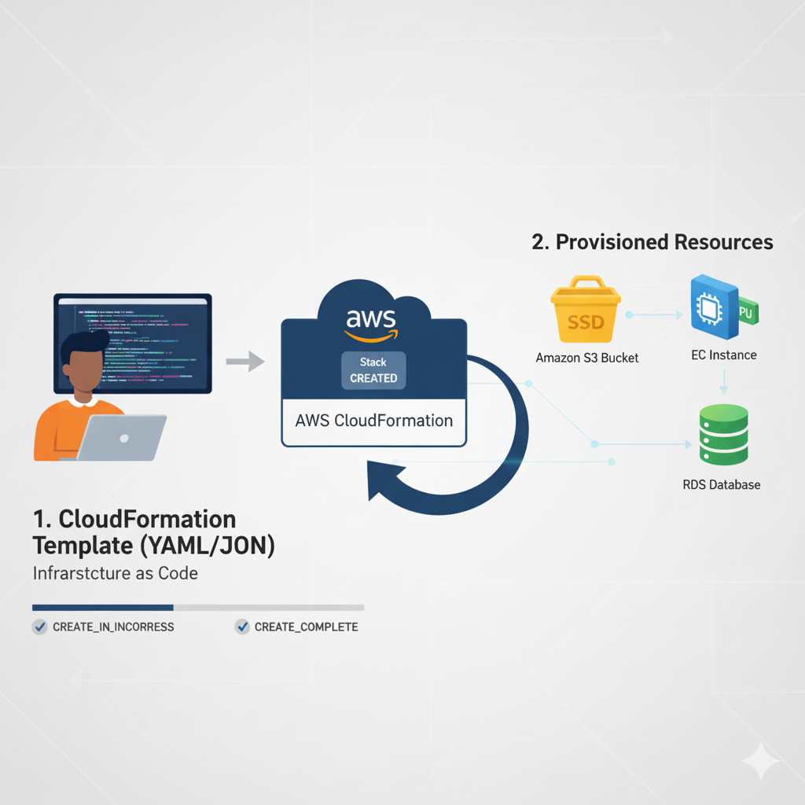

# Conceito: AWS CloudFormation e Infraestrutura como Código (IaC)

O **AWS CloudFormation** é o serviço de **Infraestrutura como Código (IaC)** da AWS que permite modelar e provisionar recursos da AWS de forma automatizada e segura. Em vez de provisionar recursos manualmente pelo console, você os define em arquivos de texto simples chamados **templates**.

## Por que usar CloudFormation (IaC)?

1.  **Reprodutibilidade:** Garante que o ambiente de Produção, Homologação e Desenvolvimento sejam idênticos.
2.  **Versionamento:** O *template* pode ser versionado (ex: Git), permitindo auditar todas as mudanças na infraestrutura.
3.  **Segurança e Controle:** Automatiza a criação de recursos com as políticas e configurações de segurança corretas.

## Componentes Chave de um Template

Um template é um arquivo em formato **JSON** ou **YAML** que contém seções estruturadas. A única seção obrigatória é `Resources`.

| Seção | Função | Descrição |
| :--- | :--- | :--- |
| **Resources** | **Obrigatória.** | Define os serviços AWS a serem criados (ex: `AWS::S3::Bucket`, `AWS::EC2::Instance`). |
| **Parameters** | Opcional. | Valores configuráveis passados no momento da criação da *stack* (ex: nome do ambiente, tipo de instância EC2). |
| **Outputs** | Opcional. | Valores retornados após a criação da *stack* (ex: URL pública de um Load Balancer, ARN de um Bucket S3). |
| **Mappings** | Opcional. | Tabelas de pesquisa condicional (ex: selecionar uma AMI diferente com base na Região da AWS). |

-----
