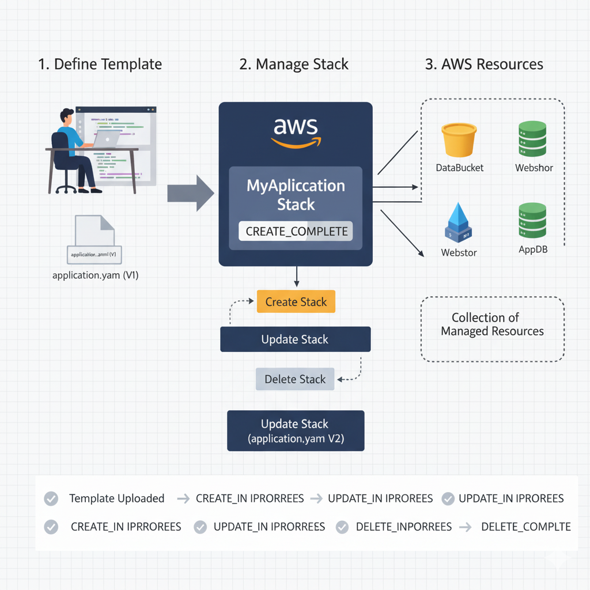

# Criando e Gerenciando Stacks

Uma **Stack** é a unidade de provisionamento gerenciada pelo CloudFormation. Ela é uma coleção de recursos AWS que são gerenciados como uma única entidade (ou seja, criados e excluídos juntos).

## Fluxo de Criação de uma Stack

1.  **Desenho do Template:** O desenvolvedor escreve o template (YAML/JSON) definindo todos os recursos.
2.  **Upload:** O template é carregado no serviço CloudFormation (via Console, CLI ou API).
3.  **Criação:** O CloudFormation lê o template e chama as APIs da AWS para criar os recursos na ordem correta, gerenciando as dependências.
4.  **Monitoramento:** Acompanha o *status* da criação (**CREATE_IN_PROGRESS** -> **CREATE_COMPLETE**).

## Lifecycle da Stack

| Operação | Descrição | Importância para IaC |
| :--- | :--- | :--- |
| **Create Stack** | Provisiona a infraestrutura do zero com base no template. | Início de qualquer ambiente. |
| **Update Stack** | Aplica mudanças a uma *stack* existente. O CloudFormation determina as mudanças mínimas necessárias. | Manutenção e evolução do ambiente sem *downtime*. |
| **Delete Stack** | Deleta todos os recursos definidos na *stack* de forma controlada. | Garante que não haja recursos "órfãos" e evita custos desnecessários. |

-----
