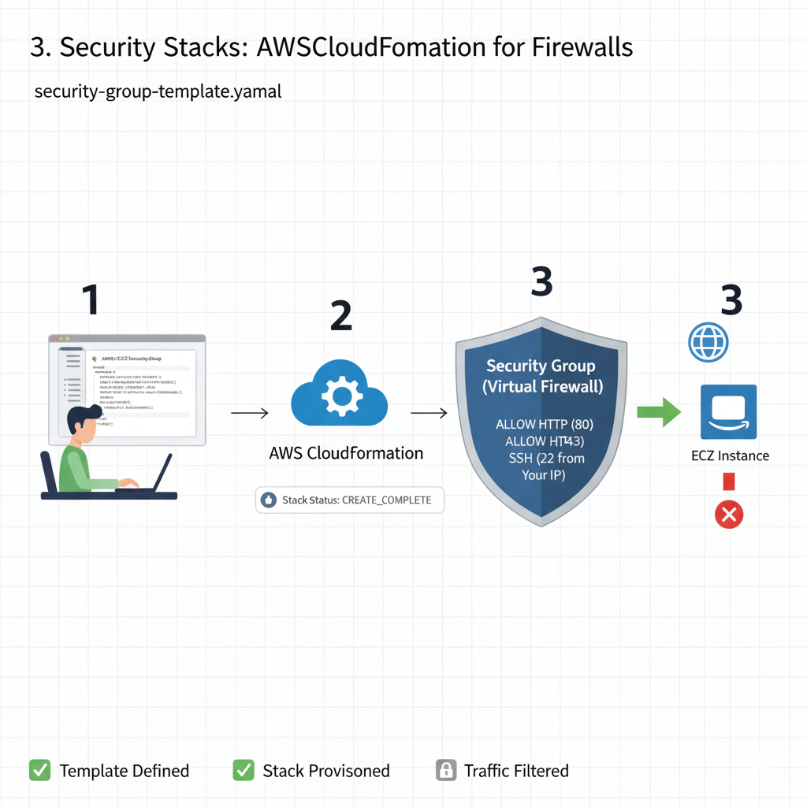

# Criando Stacks de Segurança: Security Groups (Firewall)

Um dos usos mais críticos do CloudFormation é provisionar recursos de segurança, garantindo que o acesso à infraestrutura seja restrito. O **Security Group (SG)** atua como um firewall virtual para instâncias EC2, RDS e outros serviços.


## Provisionando um Security Group Simples (YAML)

Este template cria um Security Group que permite apenas o tráfego HTTP na porta 80 e o acesso SSH na porta 22 (somente do meu IP).

**[→ Acesse o código completo do Template YAML aqui](../assets/templates/security-group-web-basico.yaml)**

```yaml
AWSTemplateFormatVersion: '2010-09-09'
Description: Template CFN para provisionar um Security Group basico...